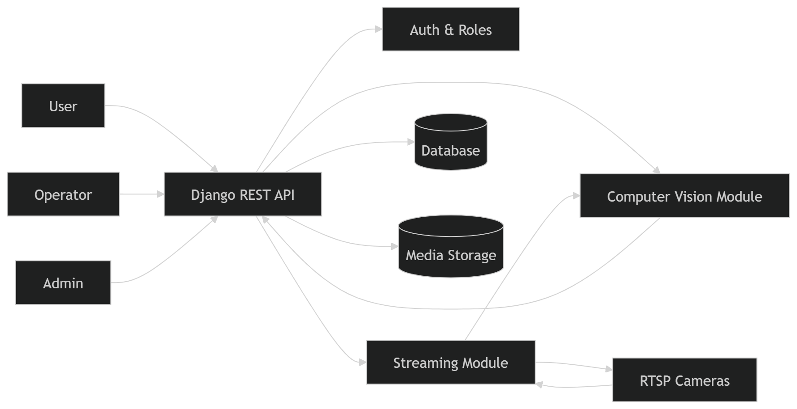

# 5. Архитектура системы

## 5.1 Общее описание

Система **RoadVision AI** построена по принципу модульной архитектуры с разделением ответственности между компонентами.

Основные задачи системы:
- приём и обработка изображений и видео
- детекция дорожных дефектов с использованием Computer Vision
- работа с RTSP-потоками (real-time)
- хранение и анализ данных
- визуализация дефектов на карте

Архитектура ориентирована на масштабируемость и дальнейший переход к распределённой системе.

---

## 5.2 Общая архитектура системы

Система состоит из следующих ключевых компонентов:

1. **Клиентский уровень (Frontend / API-клиенты)**
2. **Backend (Django + DRF)**
3. **Модуль компьютерного зрения (CV)**
4. **Модуль стриминга (RTSP)**
5. **База данных (SQLite)**

Рисунок 5.1 — Архитектура системы RoadVision AI
---

## 5.3 Компоненты системы

### 5.3.1 Клиентский уровень

Пользователи взаимодействуют с системой через API.

**Роли:**

- **User**
  - загрузка фото/видео
  - просмотр карты дефектов

- **Operator**
  - управление камерами
  - просмотр live-видео

- **Admin**
  - подтверждение дефектов
  - управление пользователями
  - генерация отчётов

---

### 5.3.2 Backend (Django + DRF)

Центральный компонент системы.

**Функции:**
- REST API
- аутентификация и авторизация
- обработка запросов
- управление бизнес-логикой
- взаимодействие с CV и streaming

---

### 5.3.3 Модуль Computer Vision (CV)

Отвечает за анализ изображений и видео.

**Функции:**
- детекция дефектов (например, YOLO)
- расчёт confidence
- генерация bounding box
- определение типа дефекта

📌 Особенность:  
если дефекты не обнаружены → данные не сохраняются

---

### 5.3.4 Модуль стриминга

Работает с RTSP-потоками.

**Функции:**
- подключение к камерам
- получение кадров
- передача кадров в CV
- управление сессиями

---

### 5.3.5 База данных

Отвечает за хранение:

- пользователей
- изображений и видео
- дефектов
- камер и стрим-сессий
- отчётов

📌 Используется SQLite (с возможностью перехода на PostgreSQL)

---

## 5.4 Потоки данных (Data Flow)

### 1. Загрузка изображения

1. Пользователь отправляет изображение
2. Backend сохраняет файл временно
3. Изображение передаётся в CV
4. Если дефекты найдены:
   - создаётся запись в БД
   - сохраняется изображение
5. Если нет:
   - файл удаляется

---

### 2. Обработка видео

Аналогично изображениям, но:
- анализируются кадры
- сохраняются дефекты с привязкой ко времени

---

### 3. Стриминг (RTSP)

1. Operator запускает камеру
2. Создаётся `StreamSession`
3. Кадры передаются в CV
4. Обнаруженные дефекты сохраняются

---

## 5.5 Взаимодействие компонентов

- DRF → управляет всеми запросами
- CV → вызывается backend’ом
- Streaming → работает через backend
- БД → хранит результат

---

## 5.6 Масштабируемость

Система спроектирована с возможностью расширения:

- переход на PostgreSQL + PostGIS
- вынос CV в отдельный сервис
- использование очередей (Celery, Redis)
- горизонтальное масштабирование

---

## 5.7 Преимущества архитектуры

- модульность
- масштабируемость
- высокая производительность
- отсутствие “мусорных данных”
- поддержка real-time обработки

---

**Вывод:**  
архитектура системы обеспечивает эффективную обработку данных и готова к промышленному использованию.

**Дата создания:** Март 2026  
**Версия документа:** 1.0