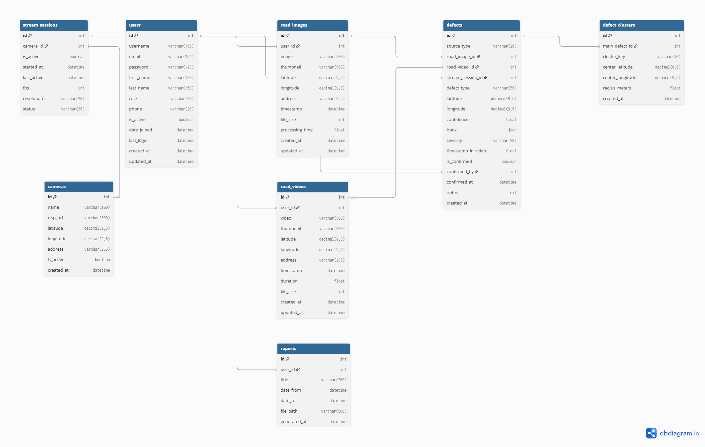

# 6. Архитектура базы данных

## 6.1 Общее описание

База данных проекта **RoadVision AI** спроектирована с учётом требований технического задания и особенностей обработки мультимедийных данных.

Ключевая особенность архитектуры — **жёсткая фильтрация данных**:  
в систему сохраняются **только те изображения и видео, на которых обнаружены дорожные дефекты**.  

Если после анализа AI дефекты не выявлены:
- файл удаляется с сервера
- запись в базе данных не создаётся

Это позволяет:
- снизить нагрузку на хранилище
- исключить нерелевантные данные
- повысить качество аналитики

---

## 6.2 Используемые технологии

- **СУБД**: SQLite (для разработки и защиты диплома)
- **ORM**: Django ORM
- **Архитектура**: реляционная база данных (3НФ)
- **Дополнительно**:
  - `JSONField` — для хранения bounding box
  - `DecimalField(9,6)` — координаты (точность до ~10 см)

---

## 6.3 ER-диаграмма
[roadvision_erd.pdf](roadvision_erd.pdf)

*Рисунок 6.1 — ER-диаграмма базы данных*

---

## 6.4 Описание моделей

### 1. `User` (Пользователи)

Расширенная модель на основе `AbstractUser`.

**Поля:**
- `id`
- `username`, `email`
- `role` — (`user`, `operator`, `admin`)
- `phone` (опционально)
- `is_active`, `date_joined`, `last_login`

---

### 2. `RoadImage` (Изображения)

Хранит изображения, на которых обнаружены дефекты.

**Поля:**
- `id`
- `user` (ForeignKey)
- `image`
- `thumbnail` (опционально)
- `latitude`, `longitude`
- `address` (опционально)
- `timestamp`
- `file_size`
- `processing_time`
- `created_at`, `updated_at`

---

### 3. `RoadVideo` (Видео)

Хранит видеофайлы с обнаруженными дефектами.

**Поля:**
- `id`
- `user` (ForeignKey)
- `video`
- `thumbnail`
- `latitude`, `longitude`
- `duration`
- `file_size`
- `timestamp`
- `created_at`, `updated_at`

---

### 4. `Camera` (Камеры видеонаблюдения)

Отвечает за управление RTSP-камерами.

**Поля:**
- `id`
- `name`
- `rtsp_url`
- `latitude`, `longitude`
- `is_active`
- `created_at`

---

### 5. `StreamSession` (Сессии стриминга)

Хранит информацию об активных видеопотоках.

**Поля:**
- `id`
- `camera` (ForeignKey → Camera)
- `is_active`
- `started_at`
- `last_active`
- `fps`
- `resolution`
- `status`

---

### 6. `Defect` (Дефекты) — центральная модель

Содержит информацию обо всех обнаруженных дефектах независимо от источника.

**Поля:**
- `id`
- `source_type` — (`IMAGE`, `VIDEO`, `STREAM`)
- `road_image` (ForeignKey, null=True)
- `road_video` (ForeignKey, null=True)
- `stream_session` (ForeignKey, null=True)

> На уровне бизнес-логики гарантируется, что заполнено только одно поле источника.

- `defect_type` — (`POTHOLE`, `CRACK`, `ALLIGATOR_CRACK`, `ROAD_MARKING`, `OTHER`)
- `latitude`, `longitude`
- `confidence`
- `bbox` (JSONField)
- `severity` — (`low`, `medium`, `high`)
- `timestamp_in_video` (опционально)
- `is_confirmed`
- `confirmed_by` (ForeignKey → User)
- `confirmed_at`
- `notes`
- `created_at`

---

### 7. `DefectCluster` (Кластеры дефектов)

Используется для предотвращения дубликатов.

**Поля:**
- `id`
- `main_defect` (ForeignKey → Defect)
- `cluster_key`
- `center_latitude`, `center_longitude`
- `radius_meters` (по умолчанию 8)
- `created_at`

---

### 8. `Report` (Отчёты)

Хранит PDF-отчёты.

**Поля:**
- `id`
- `user` (ForeignKey)
- `title`
- `date_from`, `date_to`
- `file_path`
- `generated_at`

---

## 6.5 Связи между моделями

- Пользователь → изображения/видео (`1:N`)
- Изображение/видео → дефекты (`1:N`)
- Камера → сессии (`1:N`)
- Сессия → дефекты (`1:N`)
- Администратор → подтверждение дефектов

---

## 6.6 Индексация

Для повышения производительности используются индексы:

- `latitude`, `longitude` — для геопоиска
- `defect_type` — фильтрация
- `created_at` — сортировка
- `is_confirmed` — фильтрация
- `source_type` — быстрый доступ к источнику

---

## 6.7 Особенности проектирования

1. **Фильтрация данных** — сохраняются только релевантные медиафайлы  
2. **Гибкость источников** — единая модель `Defect`  
3. **Разделение ответственности**:
   - `Camera` — управление
   - `StreamSession` — поток
4. **Кластеризация** — предотвращение дубликатов  
5. **Подготовка к масштабированию** — PostgreSQL + PostGIS  

---

## 6.8 Перспективы развития

- Переход на PostgreSQL + PostGIS  
- Использование геоиндексов (GiST)  
- Масштабирование через Celery и Redis  
- Расширение аналитики (heatmaps, статистика дефектов)

---

**Дата создания:** Март 2026  
**Версия:** 2.0 (Оптимизированная архитектура)